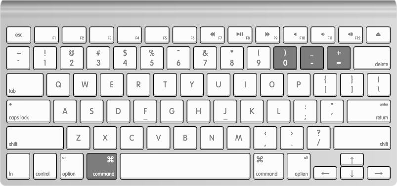
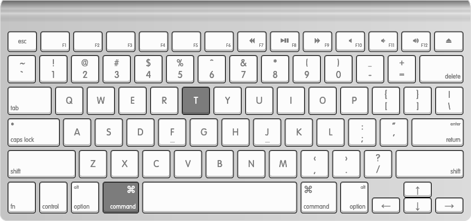
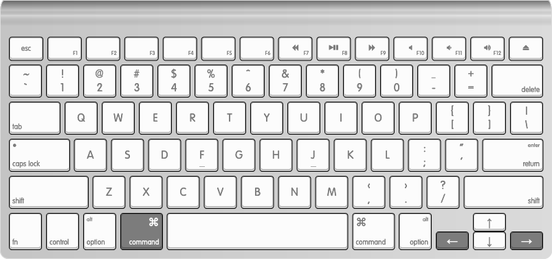
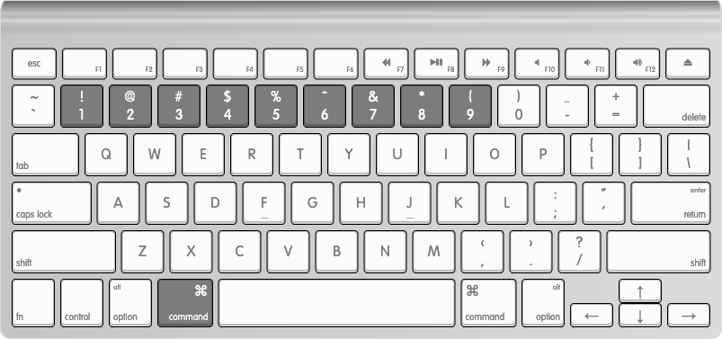
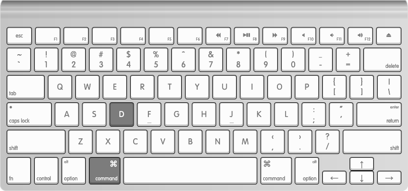
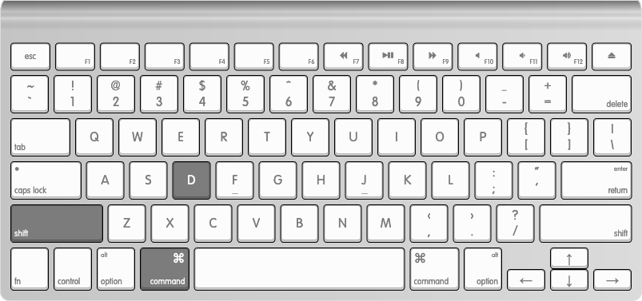
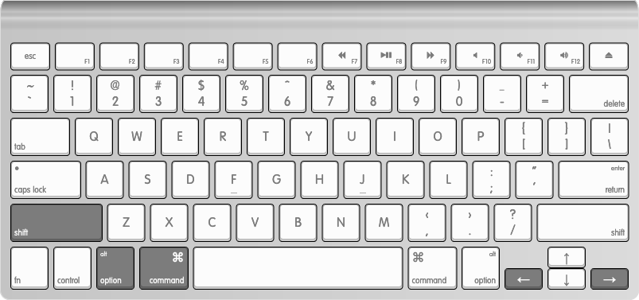
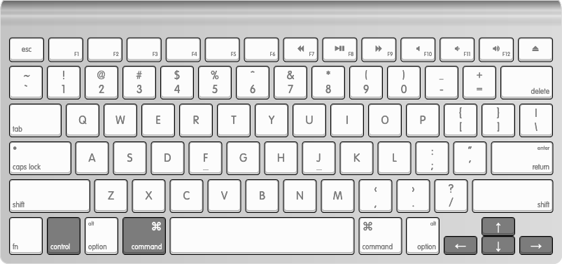
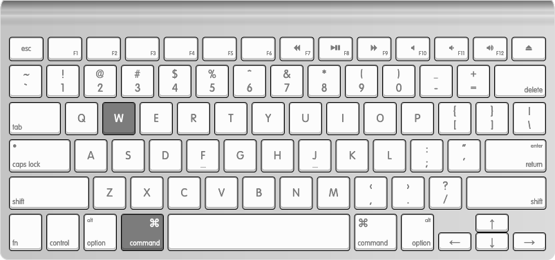
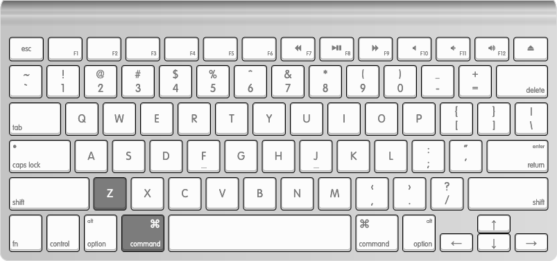

# Alacritty with tmux configuration on macOS.

### Setup

`brew install cask alacritty`

`brew install tmux`

Put config file `alacritty.yml` into alacritty config location - `~/.config/alacritty/`

Put `themes` folder with color themes from https://github.com/eendroroy/alacritty-theme into  `~/.config/alacritty/`.

Put `tmux.conf` to `~/.tmux.conf`

### Configured keys

| Key                                               | Action                                               |
| ------------------------------------------------- | ---------------------------------------------------- |
|            | ResetFontSize, IncreaseFontSize, DecreaseFontSize    |
|          | Create a new window (Tab)                            |
|          | Select the next/previous window                      |
|    | Select window 0-9 (window 0 is mapped to key 1)      |
|      | Split window (create pane) horizontally (left/right) |
|  | Split window (create pane) vertically (top/bot       |
|              | Go to the next pane left/right/top/bottom            |
|            | Move current pane to the next position               |
|        | Resize current pane by 1 row/column                  |
|          | Move current pane into a new window (‘break pane’)   |
|            | Zoom/unzoom current pane                             |